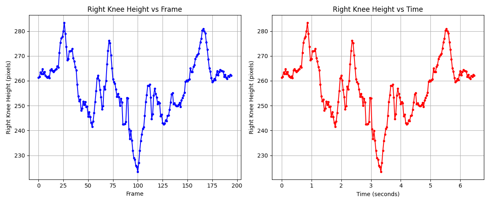
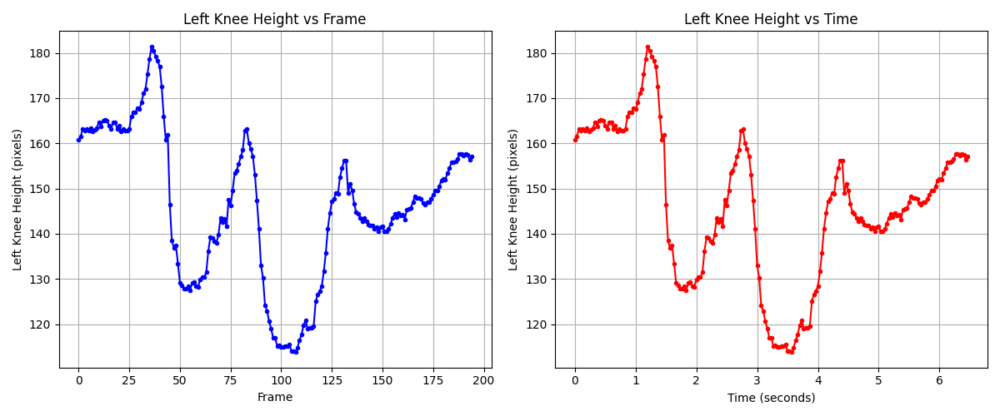

# Clinical Gait Analysis with 2D Pose Estimation (MMPose)

## Overview

This repository contains an experimental pipeline for **2D gait analysis from monocular clinical videos** using pretrained pose-estimation models from **[MMPose](https://mmpose.readthedocs.io/en/latest/)**.  
The primary focus is on extracting **lower-limb kinematics**, including **knee height over time** from real-world walking videos.

The work was conducted as part of a short-term undergraduate research internship and emphasizes **practical challenges encountered when applying pose estimation models to unconstrained clinical data**, rather than proposing a finalized or production-ready system.

## Scope

This repository contains experimental code developed for exploring pose-estimation pipelines on video data.
It focuses on implementation details, preprocessing strategies, and observed failure modes of pretrained models.

Before running the pipeline, users should ensure that MMPose and its dependencies are installed, as all pose estimation functions rely on it.  
No separate `requirements.txt` is provided; installation should follow [MMPose guidelines](https://mmpose.readthedocs.io/en/latest/installation.html).

## Pipeline Overview

The pipeline processes monocular clinical walking videos to extract and analyze lower-limb kinematics:

1. #### Frame Extraction and Pose Estimation
   - Videos are read frame by frame.
   - A pretrained **RTMPose whole-body model** is applied to each frame to estimate keypoints.
   - This specific model was chosen because it provides **more detailed keypoints for the lower limbs**, which is essential for gait analysis.
   - Visualized skeletons are generated locally in `output_frames/` for qualitative inspection (not included in the repository due to size).

2. #### Patient Selection
   - In multi-person videos, the patient of interest is selected using two functions in `knee_height.py`:
     - `extract_mask(start_frame, last_frame)`  
     - `select_patient_by_mask(keypoints_list, mask)`  
   - These functions were adapted from a project by a [colleague](https://github.com/ebtehaj-m-tarazi) from my group.  
   - The selection ensures that extracted keypoints scorrespond to the correct individual across all frames.

3. #### Lower-Limb Keypoint Analysis
   - Extracts keypoints for knees.
   - Focuses on knee height as one of the measures of gait kinematics.

4. #### Temporal Analysis
   - Knee Height Over Time: vertical distance from the bottom of the frame is tracked per frame and converted to seconds.
   - Visualizes periodic patterns and detects irregularities in gait.


## Code Structure

The repository is organized as follows:

```none
.
├── data/                          # Folder containing input videos, including temp_video.mp4
├── extract_pose_frames.py         # Runs pose estimation on a data/temp_video.mp4 and saves visualized skeleton frames locally
├── knee_height.py                 # Tracks knee height over time and generates output plots in results/
├── results/                       # Folder containing generated knee height plots 
```
>  Note: The original video used in `knee_height.py` is confidential. Users should provide their own video file and update the `video_path` variable accordingly.

## Results

Two main output plots are generated in `results/`:
  1. Left Knee (Height vs Frame/Height vs Time (seconds))
  2. Right Knee (Height vs Frame/Height vs Time (seconds))

## Observations and Analysis
- **Left Knee**: exhibits smooth, **periodic** oscillations **consistent with natural human gait**.
- **Right Knee**: shows **irregular oscillations**, especially after the second trough.

#### Interpretation:
- The patient’s left side faces the camera.
- In other words, when walking directly in front of the camera, the **left leg occludes the right leg**, reducing detection reliability for the right knee.
- This explains the irregular pattern and temporal inconsistency observed for the right knee.

#### Conclusion:
- Occlusion and camera viewpoint strongly affect pose estimation reliability.
- Temporal knee patterns from monocular videos are accurate for visible limbs, but occluded joints may produce inconsistent results.


<h4>Right vs Left Knee Height</h4>
<table>
<tr>
<td></td>
<td></td>
</tr>
</table>


